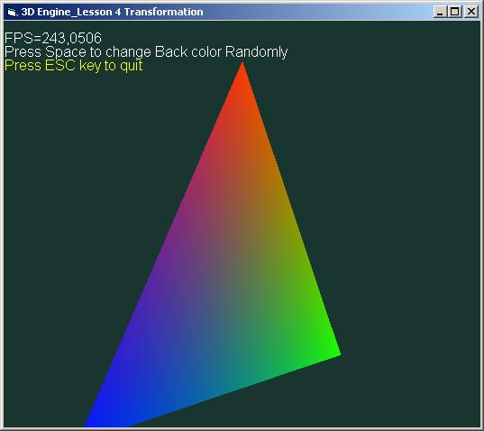



## A Quest to a 3D Engine Programming Lesson 4: Transformations

### Description

This 4th tutorial of my Quest to a 3D Engine programming series, deals with polygon drawing and object transformation (scale,rotate,translate).

It introduces a new vertex format for drawing

3D colored vertice.

Leave feedbacks and comments
 
### More Info
 

             |
---                |---
**Submitted On**   |2006-07-08 20:19:22
**By**             |[polaris](https://github.com/Planet-Source-Code/PSCIndex/blob/master/ByAuthor/polaris.md)
**Level**          |Beginner
**User Rating**    |4.0 (20 globes from 5 users)
**Compatibility**  |VB 5\.0, VB 6\.0
**Category**       |[DirectX](https://github.com/Planet-Source-Code/PSCIndex/blob/master/ByCategory/directx__1-44.md)
**World**          |[Visual Basic](https://github.com/Planet-Source-Code/PSCIndex/blob/master/ByWorld/visual-basic.md)
**Archive File**   |[A\_Quest\_to200526782006\.zip](https://github.com/Planet-Source-Code/polaris-a-quest-to-a-3d-engine-programming-lesson-4-transformations__1-65901/archive/master.zip)

